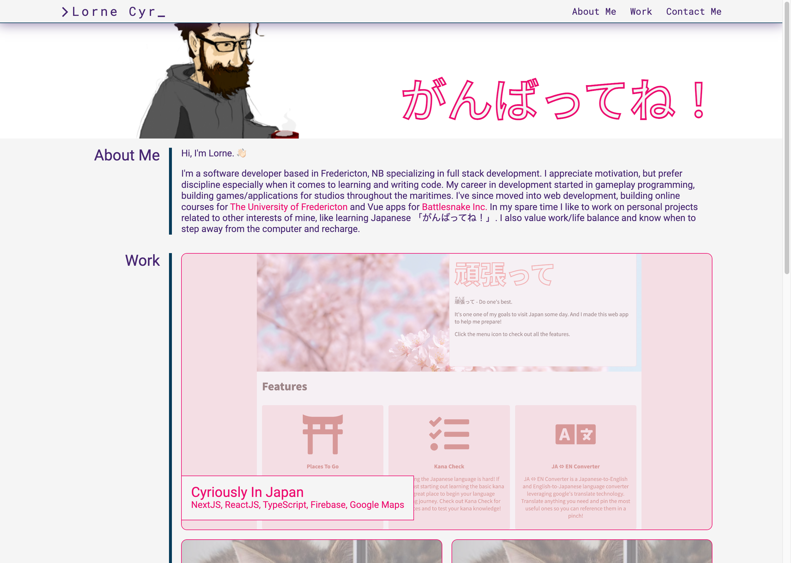

# My Portfolio

## Description

This is a portfolio site built with HTML and CSS. Designed to showcase my work and provide contact information for potential employment opportunities.

The live site can be viewed [here](https://llourn.github.io/my-portfolio/).

## Table of Contents (Optional)

- [Installation](#installation)
- [Credits](#credits)
- [License](#license)

## Installation

Being a static website there isn't much in the way of installation. Just clone the repo and open the index.html in your browser.

## Credits

Obtained the reset.css file from http://meyerweb.com/eric/tools/css/reset/

## License

MIT License Copyright (c) 2023 Lorne Cyr

## Badges

